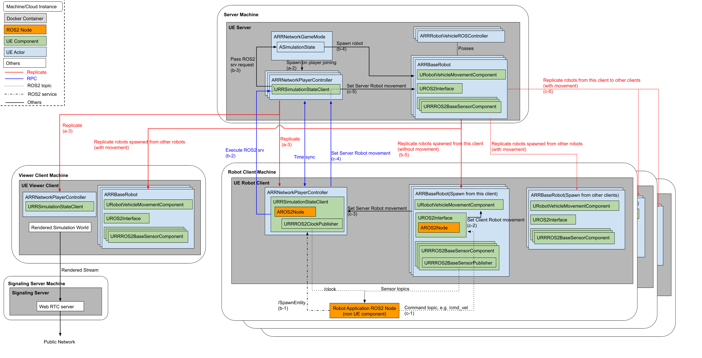
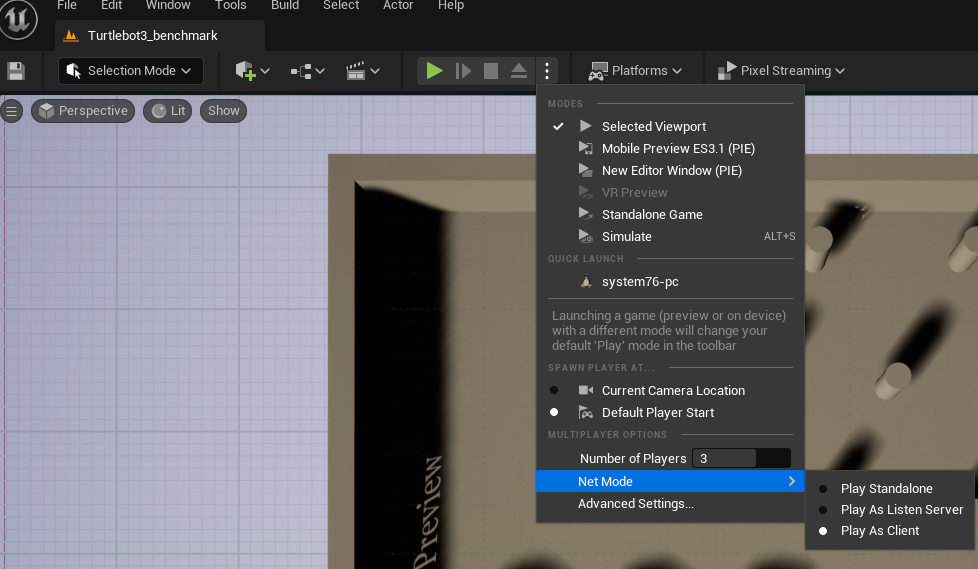

======================
Distrubuted Simulation
======================

******************************
Motivation
******************************

`UE's multiplayer capabilities <https://docs.unrealengine.com/4.27/en-US/InteractiveExperiences/Networking/>`_ 
are used in networked games such as Fortnite which has over 350 million players and allows up to 100 players to play against each other.

By combining UE's multiplayer game feature, which has a proven track record in games, with rclUE, 
it is possible to build a distributed simulator environment for ROS2-compatible robots.

Through the usage of  a distributed simulator, the load on the simulation server can be dispersed across multiple machines, 
thereby when compared to running simulations on a single machine, it will enable the simulation of robots on a large scale, 
such as an entire warehouse.

******************************
Architecture Overview
******************************

Client-Server Model
===========================

UE multiplayer is based around the client-server model. Each player is a client connected to a single server.
In the robotics simulator, we put robots in each client. 

.. figure:: images/overview_of_UE_distributed_simulation.png
   :align: center

   Figure 1: Overview of the configuration.

As seen in figure 1, the simulator consists of four types of instances. 

- **Server**: sync all state except for ROS Components in the clients.
- **Robot client**: own multiple simulated robots and robot application software.
- **Viewer client**: in charge of rendering with GPU.
- **Signaling server**: provide the view of simulation.

This configuration allows the ROS 2 node of a specific robot (Robot ROS 2 Node) and ROS application software 
to be separated from the simulation server. 

In addition, the rendering can also be separated from the server by using the viewer client to perform 
the rendering, reducing GPU usage on the server and client. 
There is also a signaling server that will run alongside the viewer client instance, 
the role of which is to provide the user with a view of the simulation over the internet. 

RPCs and Replication
===========================

Communication between Server and Client uses UE’s `replication and RPCs <https://docs.unrealengine.com/4.27/en-US/InteractiveExperiences/Networking/Actors/>`_.

**Replication** is the process to sync data between the server and the clients. Changes of Actors and properties set as "replicated" in server are synced to the clients.
Replication is a one-way process from server to client to sync data such as Actor pose and other properties.

`RPCs (Remote procesure call) <https://docs.unrealengine.com/4.26/en-US/InteractiveExperiences/Networking/Actors/RPCs/>`_
is a way to call function in client from server or the other way around. While replication provide a way to sync data from server to clients, 
RPC provide a way to change Actor status in the server from clients.
RPC function which are defined in NetworkPlayerController or NetworkPlayerController owned pawn are valid and only replciated Actor can call the function.

In this distributed simulation setup, 

- ROS 2 nodes are spawned only in the clients, i.e. replication are not used.
- Some ROS 2 components are spawned with robot at server and replicated to the clients but initialized, e.g. when starting publsiher/subscriber, only in the client which sends the spawn requests.
- Robot movements happen in the clients first and use rpc via NetworkPlayerController to sync the robot movement in the server.

******************************
Detailed Architecture
******************************

Basic flows between client and server
=====================================

   Figure 2: Detailed architecture of distributed simulation

| **Game start and NetworkPlayer Spawning**
| **(a-1)** Server starts first and create `ARRNetworkGameMode <doxygen_generated/html/d0/d30/class_a_r_r_network_game_mode.html>`_.
| **(a-2)** When Clients login, ARRNetworkGameMode spawn the `ARRNetworkPlayerController <doxygen_generated/html/db/d54/class_a_r_r_network_player_controller.html>`_ on the server.
| **(a-3)** ARRNetworkPlayerController is replicated to the client.
| **(a-4)** Replicated ARRNetworkPlayerController create ROS 2 node and start ROS 2 service server and clock publisher, then ROS 2 application can start requesting spawn robots.

| **Robot Spawning flow**
| **(b-1)** ROS 2 application call /SpawnEntity srv
| **(b-2)** `URRROS2SimulationstateClient <doxygen_generated/html/d7/d6a/class_u_r_r_r_o_s2_simulation_state_client.html>`_ in the client pass the request to the server via RPC
| **(b-3)** SimulationStateClient in the server pass the request to the `ASimulationState <doxygen_generated/html/d2/dde/class_a_simulation_state.html>`_
| **(b-4)** SimulationState spawn the robot in the server.
| **(b-5)** Spawned robot is replicated to the clients. Only in the client which sends spawn request, robot creates/initiates ROS 2 compoenent. No ROS components are created/initiated in other clients.

| **Robot Movement flow**
| **(c-1)** ROS 2 application publish command topic such as /cmd_vel
| **(c-2)** Robot in the client moves to follow command.
| **(c-3)** Robot requests `ARRNetworkPlayerController <doxygen_generated/html/db/d54/class_a_r_r_network_player_controller.html>`_ to set server robot movement
| **(c-4)** NetworkPlayerController in the client pass the request to the server via RPC
| **(c-5)** NetworkPlayerController in the server request robot to follow the command 
| **(c-6)** Robot movement is replicated to the other clients.

*When NetworkPlayer pass the request to the server, it sends current pose, 
velocity command and client timestamp at that time. 
Server will compensate network delay by comparing current server timestamp and client timestamp.*

| **Time synchronization**
| **(d-1)** Client start `Timer <https://docs.unrealengine.com/4.27/en-US/ProgrammingAndScripting/ProgrammingWithCPP/UnrealArchitecture/Timers/>`_ to sync simulation time between server and client when it is replicated to the client.
| **(d-2)**  `ARRNetworkPlayerController <doxygen_generated/html/db/d54/class_a_r_r_network_player_controller.html>`_  in the client sends current local time to the server via RPC.
| **(d-3)** NetworkPlayerController in the server received client local time via RPC and sends the current server time to the client.
| **(d-4)** NetworkPlayerController in the client compares the received client local time(sent at d-2) at that time and current client local time to estimate latency. Set local simulation time as received server time + estimated latency.

Server
===========================

The Server’s responsibilities include the handling of the Simulation State and subsequently relaying 
all of this information to each client. When the simulation begins, 
the UE Game mode is launched with the responsibility to  start all the simulation components, mainly, the Simulation State.
The Game mode also spawns a new Player Controller whenever a Client is connected. 

A Player Controller plays a role to use RPCs between the server and clients.

The Simulation State in the server is responsible for spawning any robots, 
it does this by following requests sent by an external robot software 
to the ROS 2 Service attached to the Simulation State Client in the each client. 

These components are first created on the Server itself, such that the server will have a master copy of all entities in the 
simulation. After which for all the connected clients the server will then replicate all 
of these entities to each as well as any relevant data for each entity.

Robot Client
===========================

Thus each client will then have a replicated copy of its own relevant Player Controller 
(this is only shared between the specific client and the server, 
only the server has a copy of all the player controllers), 
as well as a copy of all other entities that the server is keeping track of. 

This replicated Player Controller to use RPCs and judge spawn request comes from that client or not by using their unique PlayerId. 

Robot (child class of RRBaseRobot) has functionality to regulate client-side actions such 
as the spawning and the general setup of various components on the client, 
like their ROS 2 node, as well as any attached sensors that will publish to this ROS 2 node. 

As the ROS 2 node is spawned client-side only, there is no copy on the server and can thereby 
serve just the ROS 2 topics that are relevant to the client and its associated robot. 
Since robot components such as sensors don’t need to be shared among other robots, 
the workload of the simulated sensors on the robot are performed client-side to 
take advantage of this and thus reduce computational load on the server. 

Additionally this structure provides another benefit, 
as each client has its own ROS 2 node that is solely responsible for interacting 
with the robot software, we are able to more closely emulate cases such as: 
a real robot setup where the robot’s software is on the robot itself 
(by having both pieces of software run on the same node/container), 
or one where the software interacts with the robot remotely 
(such as the software being on the cloud or another remote device). 

Viewer Client (PixelStreaming)
==============================

Due to the nature of this setup intended for being utilized in a cloud environment,
we need a method to allow the user to view the simulation. 
This is done through the utilization of pixelstreaming[5] in a separate client image. 
Pixelstreaming essentially allows the client to stream its rendered output to a user through 
the usage of a signaling server. This signaling server is the middleman 
between the user and the pixelstreaming client, 
allowing the user to access and interact with the client through a simple web interface. 
As we intend for these images to be used in a cloud environment, 
having a web interface allows for the user to interact with the simulation without 
having to set up a local client instead. 
This pixelstreaming instance will use the most GPU computation of all the different instance 
types as it is required to render all the images before it is sent to 
the Signaling server which then forwards to the user.

Structurally on the cloud there will be a single server image and a single viewer client, 
there will be a robot client image for each robot that the user intends to add, 
this can be seen in the diagram below. 
Additionally as stated before, the server and the robot client images will be deployed on 
compute nodes that don’t necessarily have a GPU, however, a GPU is required by the viewer client. 

******************************
Example
******************************
`turtlebot3-UE <https://github.com/rapyuta-robotics/turtlebot3-UE>`_ repository has a example of distributed simulation.
`LargeGround <https://github.com/rapyuta-robotics/turtlebot3-UE/blob/devel/Content/Maps/LargeGround.umap>`_ map
has RRNetworkGame mode and large enough to spawn multiple turtlebot.

.. video:: _static/videos/tb3_distributed_simulation.mp4
   :width: 500
   :height: 300

*Video 1: Distributed simulation example with TurtleBots*

You can see the LiDAR points appear in the specific client, which measn ROS Component is spawn/initiated in specific client only.

Process to test client server
=============================
1. Open the LargeGroundMap
2. Make sure the GameMode is RRNetworkGameMode and Player setting, i.e. Net Mode is "Play As Client"
3. Press Play.
4. Send ROS 2 spawn request. 

   Figure 3: Process to test client server

Note
=====

Editor specific setting
^^^^^^^^^^^^^^^^^^^^^^^
- Simulation state client add namespace "NetworkPC<n>" to the ROS 2 Service to differentiate services in each client. If you play without editor, the namespace is not added.
- First client will becomve viewer client. Client becomes robot client from second client. 

Spawn request from ROS2
^^^^^^^^^^^^^^^^^^^^^^^
RapyutaSimulationPlugins/ExternalTest/rr_sim_tests has a example client script 
`test_random_spawn.py <https://github.com/rapyuta-robotics/RapyutaSimulationPlugins/blob/03b8be7cc3c9659205f6b14c88d3e6bef7d3bba2/ExternalTest/rr_sim_tests/rr_sim_tests/test_random_spawn.py>`_
which sends spawn request with random initial pose and sends random cmd_vel.

.. code-block:: bash
    
    ROS 2 run rr_sim_tests test_random_spawn test --ros-args -p robot_name:=tb11 --service_namespace:=NetworkPC1

| \* You need to `source fastdds_setup.sh` to communicate with ROS 2 in UE (it depends on your dds settings)
