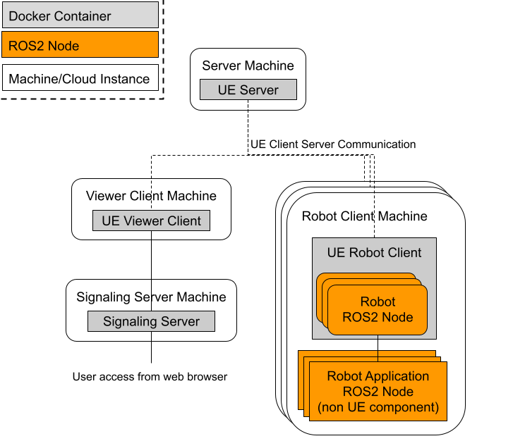

Distrubuted Simulation
======================

Motivation
----------
`UE's multiplayer capabilities <https://docs.unrealengine.com/4.27/en-US/InteractiveExperiences/Networking/>`_ 
are used in networked games such as Fortnite which has over 350 million players and allows up to 100 players to play against each other.

By combining UE's multiplayer game feature, which has a proven track record in games, with rclUE, 
it is possible to build a distributed simulator environment for ROS2-compatible robots.

Through the usage of  a distributed simulator, the load on the simulation server can be dispersed across multiple machines, 
thereby when compared to running simulations on a single machine, it will enable the simulation of robots on a large scale, 
such as an entire warehouse.

Architecture Overview
----------------------
UE multiplayer is based around the client-server model. Each player is a client and connected to single server.
In the robotics simulator, we put robots in the each client. 

Fig shows an overview of the configuration. 
The simulator consists of four types of instances. 

- Server: sync all simulation state except for ROS Components in the clients.
- Robot client: own multiple robots and robot application software.
- Viewer client: in charge of rendering with GPU.
- Signaling server: provide the view of simulation.

This configuration allows the ROS2 node for a specific robot (Robot ROS2 Node) and ROS application software 
to be separated from the simulation server. 

In addition, the rendering can also be separated from the server by using the viewer client to perform 
the rendering, reducing GPU usage on the server and client. 
There is also a signaling server that will run alongside the viewer client instance, 
the role of which is to provide the user with a view of the simulation over the internet. 

Communication between Server and Client uses UE’s `replication and RPCs <https://docs.unrealengine.com/4.27/en-US/InteractiveExperiences/Networking/Actors/>`_.

Detailed Architecture
----------------------
ROS2 node only in the client.
URRROS2SimulationstateClient initialize ROS2Component in client only.

.. image:: images/.png

Server
^^^^^^
The Server’s responsibilities include the handling of the Simulation State, 
doing all the movement calculations for the Robots and subsequently relaying 
all of this information to each client. When the simulation begins, 
the UE Game mode is launched with the responsibility to  start all the simulation components, 
mainly, the Simulation State and its associated ROS2 Node. 
The Game mode also spawns a new Player Controller whenever a Client is connected. 
A Player Controller acts as an AI Controller for a specific robot it is attached 
to as well as in the case of the viewer client, 
providing some user specific controls to allow the user to interact with the simulation, 
such as moving the camera around. The Simulation State in the server is responsible for 
spawning any robots, it does this by following requests sent by an external robot software 
to the ROS2 Service attached to the Simulation State. These components are first created 
on the Server itself, such that the server will have a master copy of all entities in the 
simulation. After which for all the connected clients the server will then replicate all 
of these entities to each as well as any relevant data for each entity.

Client
^^^^^^
Thus each client will then have a replicated copy of its own relevant Player Controller 
(this is only shared between the specific client and the server, 
only the server has a copy of all the player controllers), 
as well as a copy of all other entities that the server is keeping track of. 
This replicated Player Controller is used to regulate client-side actions such 
as the spawning and the general setup of various components on the client, 
like their ROS2 node, as well as any attached sensors that will publish to this ROS2 node. 
As the ROS2 node is spawned client-side only, there is no copy on the server and can thereby 
serve just the ROS2 topics that are relevant to the client and its associated robot. 
Since robot components such as sensors don’t need to be shared among other robots, 
the workload of the simulated sensors on the robot are performed client-side to 
take advantage of this and thus reduce computational load on the server. 

Additionally this structure provides another benefit, 
as each client has its own ROS2 node that is solely responsible for interacting 
with the robot software, we are able to more closely emulate cases such as: 
a real robot setup where the robot’s software is on the robot itself 
(by having both pieces of software run on the same node/container), 
or one where the the software interacts with the robot remotely 
(such as the software being on the cloud or another remote device). 

Replication
^^^^^^^^^^^^
The process by which the robot status is synchronized between the server and the client 
is explained using a mobile robot as an example. As the server has been set up to be 
server authoritative, this thereby means that any move by each robot will be sent to 
the server via UE’s RPC.  
The following shows the process flow when the robot moves

1. ROS Node subscribes to a movement topic such as command velocity.
2. ROS Node passes the movement information to the client side’s robot.
3. Client side robots relay this information to the server’s copy of the robot entity. 
4. The server’s copy of the robot entity will then process this movement information and then subsequently make the relevant moves
5. Robot movements will be replicated down to all the clients.

Communication between client and server can be delayed, but this configuration allows to introduce delay compensation which is used in online games.

PixelStreaming
^^^^^^^^^^^^^^^
Due to the nature of this setup intended for being utilized in a cloud environment,
we need a method to allow the user to view the simulation. 
This is done through the utilization of pixelstreaming[5] in a separate client image. 
Pixelstreaming essentially allows the client to stream its rendered output to a user through 
the usage of a signaling server. This signaling server is the middleman 
between the user and the pixelstreaming client, 
allowing the user to access and interact with the client through a simple web interface. 
As we intend for these images to be used in a cloud environment, 
having a web interface allows for the user to interact with the simulation without 
having to set up a local client instead. 
This pixelstreaming instance will use the most GPU computation of all the different instance 
types as it is required to render all the images before it is sent to 
the Signaling server which then forwards to the user.

Structurally on the cloud there will be a single server image and a single viewer client, 
there will be a robot client image for each robot that the user intends to add, 
this can be seen in the diagram below. 
Additionally as stated before, the server and the robot client images will be deployed on 
compute nodes that don’t necessarily have a GPU, however, a GPU is required by the viewer client. 

NetworkGameMode and NetworkPlayerController
--------------------------------------------
use simstate client. time sync and RPC of robots.

Time synchronization
--------------------

Client Authority and Server Authority
-------------------------------------

Example
---------
Editor only setting
- LargeMap. 
    - GameMode
    - Player setting
    - 
- sim state client has namespace
- script to spawn and send cmd

Todo
--------
- Server authority
- Delay compensation
