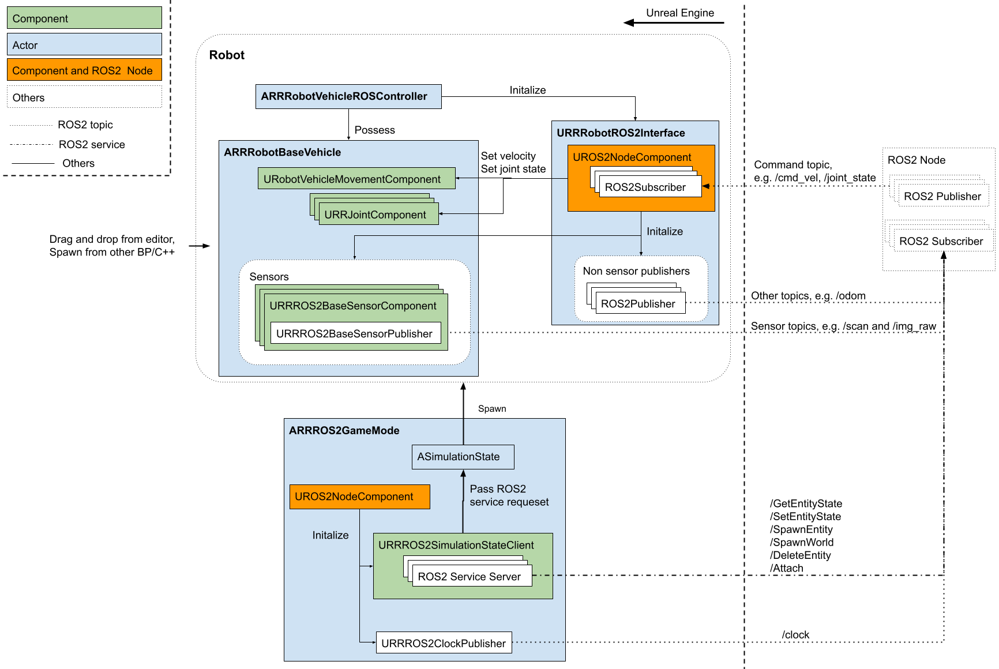

Overview
=========

Above figure shows typical way of creating Robot and GameMode with RapyutaSimulationPlugins and how expose ROS2 interfaces.
Please check each components overview in :doc:`components` and :doc:`ue_api`.

Robot
-----------------

Mobile Robot Actor is composed of 
`ARRRobotBaseVehicle <>`_, 
`URRRobotROS2Interface <>`_ and 
`ARRRobotVehicleROSController <doxygen_generated/html/d6/d83/class_a_r_r_robot_vehicle_r_o_s_controller.html>`_ .
You can create your own robot by creating child class of follwoing components.
Robot can be palced from UE interface, e.g drag and drop from UE Editor, or spawned from ROS2 /SpawnEntity srv.

- `URRRobotROS2Interface <>`_ has `AROS2Node <https://rclue.readthedocs.io/en/devel/doxygen_generated/html/d6/dcb/class_a_r_o_s2_node.html>`_ and controls publisher and subscribers in the Robot.
- `ARRRobotBaseVehicle <>`_ 
    - `URRROS2BaseSensorComponent <doxygen_generated/html/d0/d58/class_u_r_r_r_o_s2_base_sensor_component.html>`_ is base class of ROS2 sensors. Other ROS2 sensor should be child class of this class, e.g. lidar, camera, etc. `URRROS2BaseSensorPublisher <doxygen_generated/html/d5/d69/class_u_r_r_r_o_s2_base_sensor_publisher.html>`_ which publish Sensor topic and is initialized from URRROS2Interface.
    - `URobotVehicleMovementComponent <doxygen_generated/html/d7/d01/class_u_robot_vehicle_movement_component.html>`_ is base class of Robot movement. Other movement class should be child class of this class, e.g. differential drive, ackermann drive, etc. 
    - `URRJointComponent <>`_ is representative of Joint of the robot which can be controlled from `URRROS2Interface <>`_.
- `ARRRobotVehicleROSController <>`_ has authority to start/stop ROS2 publishers.

| \* This provide typical way of creating robot. You should be able to create Actor which has ROS interfaces with arbitrary architecture. 
| \* Following the Pawn and AIController structure in Unreal Engine, `Ref <https://docs.unrealengine.com/4.27/en-US/InteractiveExperiences/Framework/Pawn/>`_.

GameMode
-----------------

The GameMode start all the simulation components, mainly the Simulation State and its associated ROS2 Node. 

- `ASimulationState <doxygen_generated/html/d2/dde/class_a_simulation_state.html>`_ has implementation of ROS2 services and communicate with URRROS2SimulationstateClient. 
- `URRROS2SimulationstateClient <>`_ provides ROS2 services interface to manipulate actors.
- `URRROS2ClockPublisher <doxygen_generated/html/d5/dc2/class_u_r_r_r_o_s2_clock_publisher.html>`_ publish /clock.

| \* `ASimulationState <doxygen_generated/html/d2/dde/class_a_simulation_state.html>`_  and `URRROS2SimulationstateClient <>`_` are separated to be used in client-server.
| \* `ASimulationState <doxygen_generated/html/d2/dde/class_a_simulation_state.html>`_ has `SpawnableEntitiTypes <>`_ and only able to spawn actor from classes in SpawnableEntitiTypes.
| \* `ASimulationState <doxygen_generated/html/d2/dde/class_a_simulation_state.html>`_ has `Entities <>`_ and only able to manipulate actors Entities.
| \* You need to use specific method to add actors to the variables if you want to manipulate from ROS2 services. Actors in the level at beginplay and spawned actor by ROS2 services are added automatically. You can change spawnable entities in level BP, by overwriting game mode and etc.

.. list-table:: SimulationState ROS2 Service 
   :header-rows: 1

   * - Service name
     - Service type
     - About
   * - /GetEntityState
     - `GetEntityState.srv <https://github.com/rapyuta-robotics/UE_msgs/blob/devel/srv/GetEntityState.srv>`_
     - return the actor actor state
   * - /SetEntityState
     - `SetEntityState.srv <https://github.com/rapyuta-robotics/UE_msgs/blob/devel/srv/SetEntityState.srv>`_
     - et the actor state.
   * - /GetEntityState
     - `Attach.srv <https://github.com/rapyuta-robotics/UE_msgs/blob/devel/srv/Attach.srv>`_
     - return the actor actor state
   * - /SpawnEntity
     - `SpawnEntity.srv <https://github.com/rapyuta-robotics/UE_msgs/blob/devel/srv/SpawnEntity.srv>`_
     - spawn actor
   * - /SpawnEntities
     - `SpawnEntities.srv <https://github.com/rapyuta-robotics/UE_msgs/blob/devel/srv/SpawnEntities.srv>`_
     - spawn many actors from a list
   * - /SpawnWorld
     - `SpawnWorld.srv <https://github.com/rapyuta-robotics/UE_msgs/blob/devel/srv/SpawnWorld.srv>`_
     - spawn world from `SDF <http://sdformat.org/>`_
   * - /DeleteEntity
     - `DeleteEntity.srv <https://github.com/rapyuta-robotics/UE_msgs/blob/devel/srv/DeleteEntity.srv>`_
     - return the actor actor state
   * - /Attach
     - `Attach.srv <https://github.com/rapyuta-robotics/UE_msgs/blob/devel/srv/Attach.srv>`_
     - attach two actors which are not connected or detach two actors which are connected.
