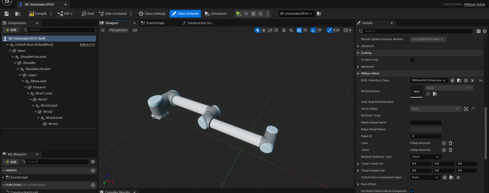

Robot Arm
=========

Example Robots
--------------

.. contents:: Index
   :depth: 4

.. list-table:: ROS 2 Interface
   :header-rows: 1

   * - Topic name
     - Topic type
     - About
   * - joint_states
     - `sensor_msgs/msg/JointState <https://docs.ros2.org/galactic/api/sensor_msgs/msg/JointState.html>`_
     - joint state command

Robot arm are designed to be controlled by joint state msg. 

.. code-block:: bash

        $ ros2 topic pub /arm/joint_states sensor_msgs/msg/JointState  "{header: {stamp: {sec: 0, nanosec: 0}, frame_id: ''}, name: ['joint12', 'joint23', 'joint34'], position: [1.57,1.57,1.57], velocity: [], effort: []}"

SimpleArm 
^^^^^^^^^^^^^^

- `BP_KinematicSimpleArm <https://github.com/rapyuta-robotics/RapyutaSimulationPlugins/blob/devel/Content/Robots/SampleArm/BP_KinematicSimpleArm.uasset>`_
    Example kinematic robot implementation in BP. 

    This BP class is child class of ARRBaseRobot and added joint and link setting. 
    
    .. image:: ../images/simple_arm.png

    In `Construction script in BP <https://docs.unrealengine.com/5.1/en-US/construction-script-in-unreal-engine/>`_, 
    all joint and link relations are set. JointName which is used by ROS 2 is also set in here. 

    .. image:: ../images/simple_arm_construction_script.png

UR10 
^^^^^^^^^^^^^^
These BP class are child class of ARRBaseRobot and added joint and link setting. 

reference: `Universal_Robots_ROS2_Description <https://github.com/UniversalRobots/Universal_Robots_ROS2_Description/tree/ros2/meshes>`_

In `Construction script in BP <https://docs.unrealengine.com/5.1/en-US/construction-script-in-unreal-engine/>`_, 
all joint and link relations are set. JointName which is used by ROS 2 is also set in here. 

These robots can be controlled with ur_description package.

.. code-block:: shell

    sudo apt install ros-humble-ur-description
    ros2 launch ur_description view_ur.launch.py ur_type:=ur10

- `BP_KinematicUR10 <https://github.com/rapyuta-robotics/RapyutaSimulationPlugins/blob/devel/Content/Robots/UR10/BP_KinematicUR10.uasset>`_
    Joints are `URRKinematicJointComponent <doxygen_generated/html/d2/d69/class_u_r_r_kinematic_joint_component.html>`_
    
    .. video:: ../_static/videos/ur10_kinematic.mp4
        :width: 750
        :height: 450

-  `BP_PhysicsUR10 <https://github.com/rapyuta-robotics/RapyutaSimulationPlugins/blob/devel/Content/Robots/UR10/BP_PhysicsUR10.uasset>`_
    Joints are `URRPhysicsJointComponent <doxygen_generated/html/da/dfb/class_u_r_r_physics_joint_component.html>`_
    
    .. video:: ../_static/videos/ur10_physics.mp4
        :width: 750
        :height: 450

Todo
--------------------------
- Support ros2 control
- Add moveit example

Custom Robot Creation TIPS
--------------------------

To create custom mobile robot

1. Create child class of ARRBaseRobot
    1. Overwrite default parameters.
        1. Set `bMobileRobot <../doxygen_generated/html/df/d13/class_a_r_r_base_robot.html#a315bb15cfa368ec652622e27ae150c6a>`_ false.
    2. Configure meshes and joints in BP
    3. Configure construction script to set joint and link relations similar as BP_KinematicSimpleArm.
    4. If you want to dynamically spawn robots and pass random parameters, overwrite `InitPropertiesFromJSON() <../doxygen_generated/html/df/d13/class_a_r_r_base_robot.html#a214c5936450e3b17dffaad40e944bea6>`_ 

3. Create child class of URRROS2Interfaces
    1. Overwrite default parameters such as topic name.
    2. Add necessary ROS Interfaces. Please also refer `rclUE tutorials <https://rclue.readthedocs.io/en/latest/examples.html#topic-service-action-examples>`_.

4. Create ROS 2 Service client of  `/SpawnEntity <https://github.com/rapyuta-robotics/UE_msgs/blob/devel/srv/SpawnEntity.srv>`_ and pass necessary parameters outside of UE if you want to dynamically spawn robots from outside of UE

